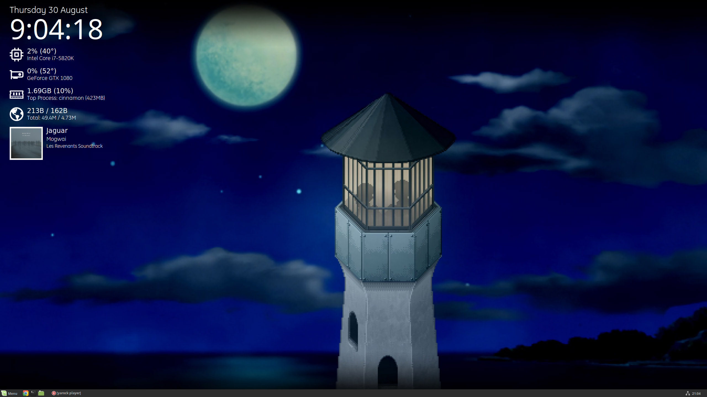

# conky-modern
### A modern theme for conky with media and hardware information



## Installation
Run the following command in a terminal:
```
wget -O - https://github.com/jamerst/conky-modern/raw/master/install.sh | bash
``` 
This will download and run the install.sh script, which will clone the repository into the correct directory, install the necessary font, and create a symlink to ~/.conkyrc. Any existing .conkyrc will not be overwritten, but will be renamed.

Alternatively, just clone the github repository manually into ~/.conky/conky-modern and install the font in the fonts folder, then create a symlink from ~/.conky/conky-modern/conky-modern.conky to ~/.conky, or start conky with an explicit reference to the theme file using the -c option.

## Configuration
As with all conky themes, this theme probably isn't very portable. It's configured and tested to work on my system, since that's the system I use it on, but to get it working to your liking on your system, you may have to modify it. This section covers the most common modifications you may need to make.

### Setting Position
The position of the meter can be set using the ```alignment```, ```gap_x``` and ```gap_y``` variables in the conky theme file (~/.conkyrc if you used the install script). The theme is best optimised for the ```top_left``` alignment, and it hasn't been tested with the other layouts, so I wouldn't advise changing this. If you find that the theme displays on the wrong monitor, as I found it did, using a large/negative value for ```gap_x``` was the easiest way I found to move it to the correct monitor.

### Setting Media Player
To change the media player for the theme to read data from, you must change every instance of ```yarock``` in the theme file to the name of your chosen player. For this theme to work, your chosen player needs to implement [MPRIS](https://specifications.freedesktop.org/mpris-spec/latest/). If your player doesn't implement MPRIS, but has an alternative way to extract data about the currently playing media, you can modify the scripts in ~/.conky/conky-modern/scripts to perform the data retrieval actions.

### GPU Information
I can only test with an Nvidia GPU and the Nvidia proprietary driver, but if you're using an AMD or Intel GPU, or even a different driver, you'll need to modify the commands used to get GPU information since none of them are native to conky. I don't know and can't test the specific commands needed, so you'll need to use Google to find commands that work for you, then simply change the commands in the ```execi``` variables.

## Known Issues
- The clock has an odd gap on the left when showing a single digit hour.

## Attributions
- Based originally on [conky-spoclo](https://github.com/Dacha204/conky-spoclo)
- Icons from [sysDash](https://github.com/MarcoPixel/SysDash) and [Font Awesome](https://fontawesome.com/)
